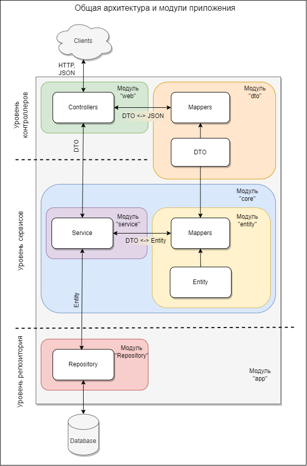

# Система управления проектами
### Итоговое задание для Java Школы 2023 Digital Design

Предполагается строить приложение по следущющей архитектуре:

### Описание архитектуры
В приложении планируется 3 основных уровня:
1. Уровень контроллеров - уровень представления, на котором происходит получение запросов от пользователей 
и подготовка ответов;
2. Уровень сервисов - уровень бизнес-логики, на котором производится работа с полученными или отсылаемыми данными;
3. Уровень репозитория - уровень управления, обработки и хранения информации.
Уровни будут взаимодействовать между собой последовательно: уровень контроллеров с уровнем сервисов, 
сервисы с репозиторием и аналогично в обратном порядке.

Помимо логического разделения на уровни,  приложение будет разделяться на модули, выполняющие конкретную функцию. 
В отдельные модули также планируется выделить блоки приложения которые обеспечивают взаимодействие между уровнями 
приложения (DTO).

### Описание модулей
1. Модуль “app”
Базовый модуль, точка входа в приложение.
2. Модуль “web”
Модуль отвечает за прием и обработку HTTP запросов, подготовку и отправку ответов клиентам. 
Полученные из запроса данные передаются в модуль “service” модуля “core” для их дальнейшей обработки. 
Данные для подготовки ответа клиенту также поступают от модуля “service”.
Обмен данными с модулем “service” используются DTO объекты. 
Для представления данных в виде DTO объекта модуль “web” взаимодействует с модулем “dto”.
3. Модуль “dto”
Данный модуль служит для представления различной информации (из HTTP запросов, из базы данных) в виде 
специализированных DTO объектов, с помощью которых осуществляется передача информации между некоторыми модулями.
Не относится непосредственно к какому-либо уровню приложения, т.к. в основном обеспечивает взаимодействие между 
уровнями контроллеров и сервисов.
4. Модуль “core”
Модуль модуль состоит из нескольких подмодулей и объединяет в себе основные сущности и бизнес-логику приложения.
- Модуль “service”
Модуль содержит бизнес-логику приложения. Взаимодействует с модулем “web” для получения входящих данных и 
отправки обработанных. Взаимодействует  с модулем “entity” для преобразования DTO объектов в сущности (Entities) 
и наоборот. Модуль выполняет функции управления информацией путем взаимодействия с модулем “repository”.
- Модуль “entity”
Содержит основные сущности участвующие в бизнес-логике приложения. 
Взаимодействует с модулем  “dto” для преобразования сущностей в DTO объекты и наоборот.
5. Модуль “repository”
Взаимодействует непосредственно с базой данных для управления сущностями. Получает сущности из модуля  “service”.

### Основные блоки задач

| Блок задач               | Описание                                                                                                                           |
|--------------------------|------------------------------------------------------------------------------------------------------------------------------------|
| Сущности                 | Определение основных сущностей, выделение необходимых атрибутов,  опеределние связей между сущностями.                    |
| Уровень репозитория и БД | Проектирование структуры БД, создание создание структуры БД, создание репозиториев  (классов управления сущностями в БД). |
| Уровень сервисов         | Определение основных операций над сущностями и создание соответствующих методов.                                                   |
| DTO                      | Создание DTO необходимых для обмена данными между контроллерами и сервисами.                                                       |
| Уровень контроллеров     | Определение структуры запросов и ответов. Определение endpoint-ов.                                                                 |
| Тесты                    | Покрытие юнит и интеграционными тестами.                                                                                           |
| Логирование              | Определение объема, уровней и деталей логирования                                                                                  |

### Комментарий к домашнему заданию

В проекте созданы модули согласно предлагаемой архитектуры, в модулях созданы пакеты, а также dummy-классы 
без функционала. В основном модуле 'app' находится метод main, в котором происходит создание экземпляров классов 
и вывод сообщений об этом в консоль. Это сделано для проверки доступности модулей на текущем этапе.
Сборку проекта и создание docker-compose можно выполнить скриптом build-image.