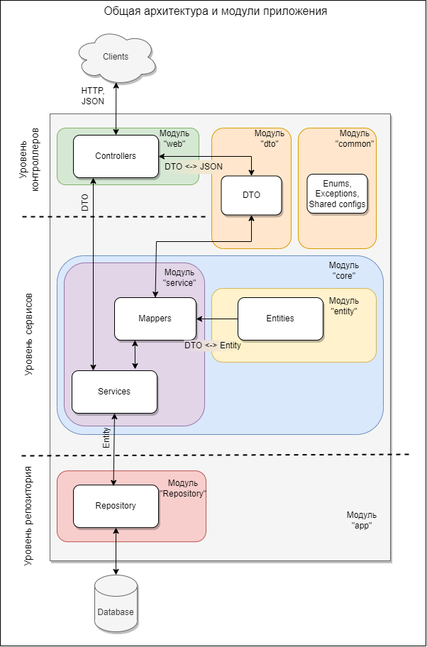
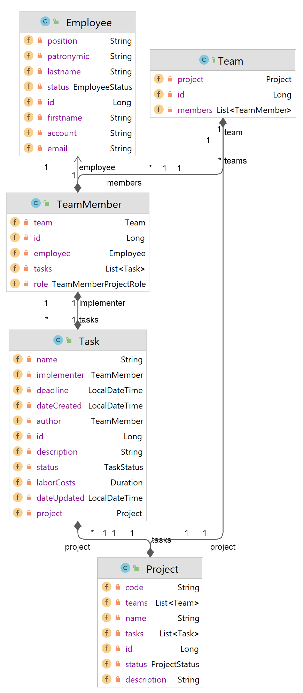

# Система управления проектами

### Итоговое задание для Java Школы 2023 Digital Design

  
Схема архитектуры

Предполагается строить приложение по следущющей архитектуре:

    
Описание архитектуры

### Описание архитектуры

В приложении планируется 3 основных уровня:

1. Уровень контроллеров - уровень представления, на котором происходит получение запросов от пользователей
   и подготовка ответов;
2. Уровень сервисов - уровень бизнес-логики, на котором производится работа с полученными или отсылаемыми данными;
3. Уровень репозитория - уровень управления, обработки и хранения информации.
   Уровни будут взаимодействовать между собой последовательно: уровень контроллеров с уровнем сервисов,
   сервисы с репозиторием и аналогично в обратном порядке.

Помимо логического разделения на уровни, приложение будет разделяться на модули, выполняющие конкретную функцию.
В отдельные модули также планируется выделить блоки приложения которые обеспечивают взаимодействие между уровнями
приложения (DTO).

    
Описание модулей

### Описание модулей

1. Модуль “app”
   Базовый модуль, точка входа в приложение.
2. Модуль “web”
   Модуль отвечает за прием и обработку HTTP запросов, подготовку и отправку ответов клиентам.
   Полученные из запроса данные передаются в модуль “service” модуля “core” для их дальнейшей обработки.
   Данные для подготовки ответа клиенту также поступают от модуля “service”.
   Обмен данными с модулем “service” используются DTO объекты.
   Для представления данных в виде DTO объекта модуль “web” взаимодействует с модулем “dto”.
3. Модуль “dto”
   Данный модуль служит для представления различной информации (из HTTP запросов, из базы данных) в виде
   специализированных DTO объектов, с помощью которых осуществляется передача информации между некоторыми модулями.
   Не относится непосредственно к какому-либо уровню приложения, т.к. в основном обеспечивает взаимодействие между
   уровнями контроллеров и сервисов.
4. Модуль “core”
   Модуль модуль состоит из нескольких подмодулей и объединяет в себе основные сущности и бизнес-логику приложения.

- Модуль “service”
  Модуль содержит бизнес-логику приложения. Взаимодействует с модулем “web” для получения входящих данных и
  отправки обработанных. Взаимодействует с модулем “entity” для преобразования DTO объектов в сущности (Entities)
  и наоборот. Модуль выполняет функции управления информацией путем взаимодействия с модулем “repository”.
- Модуль “entity”
  Содержит основные сущности участвующие в бизнес-логике приложения.
  Взаимодействует с модулем “dto” для преобразования сущностей в DTO объекты и наоборот.

5. Модуль “repository”
   Взаимодействует непосредственно с базой данных для управления сущностями. Получает сущности из модуля “service”.

    
Основные блоки задач

### Основные блоки задач

| Блок задач               | Описание                                                                                                                      |
|--------------------------|-------------------------------------------------------------------------------------------------------------------------------|
| Сущности                 | Определение основных сущностей, выделение необходимых атрибутов,  опеределние связей между сущностями.                    |
| Уровень репозитория и БД | Проектирование структуры БД, создание создание структуры БД, создание репозиториев  (классов управления сущностями в БД). |
| Уровень сервисов         | Определение основных операций над сущностями и создание соответствующих методов.                                              |
| DTO                      | Создание DTO необходимых для обмена данными между контроллерами и сервисами.                                                  |
| Уровень контроллеров     | Определение структуры запросов и ответов. Определение endpoint-ов.                                                            |
| Тесты                    | Покрытие юнит и интеграционными тестами.                                                                                      |
| Логирование              | Определение объема, уровней и деталей логирования                                                                             |

    
Комментарий к домашнему заданию №2

### Комментарий к домашнему заданию №2

В проекте созданы модули согласно предлагаемой архитектуры, в модулях созданы пакеты, а также dummy-классы
без функционала. В основном модуле 'app' находится метод main, в котором происходит создание экземпляров классов
и вывод сообщений об этом в консоль. Это сделано для проверки доступности модулей на текущем этапе.
Сборку проекта и создание docker-compose можно выполнить скриптом build-image.

    
Комментарий к домашнему заданию №3

### Комментарий к домашнему заданию №3

**1. Сущности**

Классы сущностей созданы в модуле core-entity.

Сотрудник представлен классом Employee. Статус сотрудника вынесен в отдельный Enum EmployeeStatus.

Проект представлен классом Project. Статус проекта вынесен в отдельный Enum ProjectStatus.
Помимо основных полей проект содержит список команд (Teams) которые относятся к этому проекту,
а также список задач (Task) которые выполняются в рамках проекта.

Команда проекта представлена классов Team. Содержит ссылку на Project к которому относится, а также
список участников команды (TeamMember).

Участник команды представлен классом TeamMember. Класс имеет ссылку на команду Team, в которую он входит и
на сотрудника Employee. Участник команды имеет роль в команде, которая вынесена в Enum TeamMemberProjectRole.
Также в классе содержится ссылка на список задач (Task) исполнителем по которым является участник команды.

Задача представлена классом Task. Содержит ссылку на TeamMember автора и TeamMember исполнителя, также ссылку на
Project к которому относится. Статус задачи определен в Enum TaskStatus.

Все классы Enum вынесены в отдельный модуль common, чтобы не допустить циклических зависимостей модулей.

    
Диаграмма классов:

**2. DTO**

В модуле dto созданы классы DTO по сущностям и разбиты на группы request и response.
На текущем этапе я смог выделить однотипный набор DTO для сущностей. Для входящих запросов
это DTO для create и update, а также для изменения статусов. Для response создал по одному DTO для каждой сущности.

Для поисковых запросов созданы DTO (EntityName)Filter которые будут содержать параметры поиска.

**3. Практическое задание на разработку dataStorage**

Для сущности Employee созданы EmployeeController, EmployeeService и EmployeeRepository.
EmployeeRepository при создании создает хранилище - в папке проекта создается папка storage, а в ней папка employees.
Сущности Employees сохраняются в папку employees в виде файлов без расширения, 1 файл - 1 сущность.
Имя файла соответствует id сущности.

При создании сущности происходит запись объекта в новый файл.
При изменении объект перезаписывается в существующий файл.
При удалении происходит изменение статуса EmployeeStatus на DELETED, но сам файл не удаляется (Согласно описания в ТЗ
при удалении сотрудник не удаляется, только меняется статус). Сотрудника со статусом DELETED уже изменить нельзя.

В методах EmployeeService и EmployeeRepository выбрасываемые исключения "проглатываются", а также есть некотроые
допущения в коде для целей отладки и проверки функционала. Такие допущения старался помечать.

Для проверки в методе main в классе App создается EmployeeController и выполняется ряд запросов.

    
Комментарий к домашнему заданию №4

1. Создать физическую модель БД в виде диаграммы. На модели должны быть отражены таблицы(сущности)
   с необходимыми аттрибутами(в том числе типами) и связи между таблицами.

Создана папка docs/images, туда добавлена схема БД Database-scheme.

2. Написать и отладить SQL-скрипты для создания схемы БД.
   Создать файлик schema.sql(в resources).
   В нем должны быть скрипты на создание схемы БД с "нуля". Скрипты должны соответсвовать физической модели.
   Запустить скрипты на локальной БД, проверить, что схема создалас корректно
   (нет ошибок, все связи правильно прописаны и тп). Попробовать накидать данных и сделать пару выборок.

В папке docker-compose/imports/db созданы файлы:

- 02-schema.sql - создает таблицы БД;
- db.test-changelog-1.0.sql - тестовая вставка данных в БД;
- 04-test-select.sql - тестовые запросы в БД;

3. Создать документ с описанием таблиц, колонок и тп. Создать файлик shema.md(в resources либо в каталоге docs).
   В нем должно краткое описание(что такое, для чего) всех таблиц и аттрибутов.

В папке docs создан файл schema.md c описанием таблиц.

4. Реализовать базовые операции над сущностями с помощью JDBC.
   Выбрать какую-нибудь сущность(модель) и реализовать для нее CRUD операции + поиск.
   Поиск должен включать join хотя бы по 2 таблицам. Фильтр на поиск - ДТО, состоящая из нескольких аттрибутов из разных
   таблиц.

Реализованы CRUD операции для сущностей Employee и Tasks.
В модуле repository созданы классы EmployeeJdbcRepositoryImpl и TaskJdbcRepositoryImpl, а также утилитные классы
ConnectionPropertiesUtil и ConnectionManager.

ConnectionPropertiesUtil отвечает за ситывание файла свойств application-jdbc.properties в папке resources модуля
repository.
ConnectionManager отвечает за загрузку JDBC драйвера и открытие соединения с БД (Connection).

EmployeeJdbcRepositoryImpl реализует основные CRUD операции над сущностью Employee и поиск согласно ТЗ:

*Поиск осуществляется по текстовому значению, которое проверяется по атрибутам Фамилия, Имя, Отчество,
учетной записи, адресу электронной почты и только среди активных сотрудников.*

TaskJdbcRepositoryImpl реализует основные CRUD операции над сущностью Task и поиск согласно ТЗ:

*Поиск задач - задачи должны искать по текстовому значению (по полям Наименование задачи) и с применением фильтров
(по статусам задачи, по исполнителю, по автору задачи, по периоду крайнего срока задачи, по периоду создания задачи).
Фильтры все не обязательны, как и текстовое поле.
Результат должен быть отсортирован по дате создания задачи в обратном порядке (сначала свежие задачи).*

TaskJdbcRepositoryImpl реализует запрос с JOIN по таблицам employees и projects.
Для поиска по фильтру используется DTO TaskFilter который имеет аттрибуты из таблиц tasks и employee.

В методе main класса App, модуля app написаны тестовые запросы для Employee и Task для проверки функционала.
Приложение можно запустить в docker'е скриптом build-image в папке проекта.
Для остановки испольовать docker-compose down -v или удалить сервис db вручную, чтобы при перезапуске
заново прошла инициализация БД.

    
Комментарий к домашнему заданию №6

1. Разработать веб API для итогового проекта с использованием Spring MVC.

Создано web API - в модуле web создданы REST-контроллеры.

2. Покрыть веб слой документацией с помощью Spring Doc.
3. Описать с помощью аннотаций ваши DTO и контроллеры.

Подключен open-api, создано описание контроллеров и DTO помощью аннотаций

4. Подключить аутентификацию к итоговому проекту с помощью Spring Security. Можно использовать любой тип аутентификации.

Подключен Spring Security. Настроена аутентификация по логину и паролю (в модуле app создан WebSecurityConfig). Пароль в
зашифрованном виде хранится в бд.

    
Комментарий к домашнему заданию №7

1. Составить тест-кейсы по функциональным требованиям для одного сервиса.
   Оформить тесты по стандарту в форме таблицы в документе/таблице, включить в проект.

Составлены тест-кейсы, в папке docs/test-cases.

2. Реализовать функциональные тесты по тест-кейсам.

Созданы unit-тесты для EmployeeService.
Тесты собраны в группы (@Nested) по каждому методу EmployeeService.

3. Реализовать как можно много модульных, интеграционных (с использованием testContainers) тестов.

Созданы интеграционные тесты для всех методов EmployeeService, а также несколько тестов для EmployeeController.

4. Подключить log4j2, добавить логов в код, по возможности разделить логи на файлы в зависимости от вашего понимания.

Подключен log4j2 вместо logback. Настроены логгеры для сервисов employee, project, task.
Настроены аппендеры записи в файлы. Логгеры логируют события создания, изменения и удаления Employee, Project, Task.
Настроены аппендеры для записи важных событий в отдельные файлы при помощи фильтра (отдельные файлы для уровня Warn).

